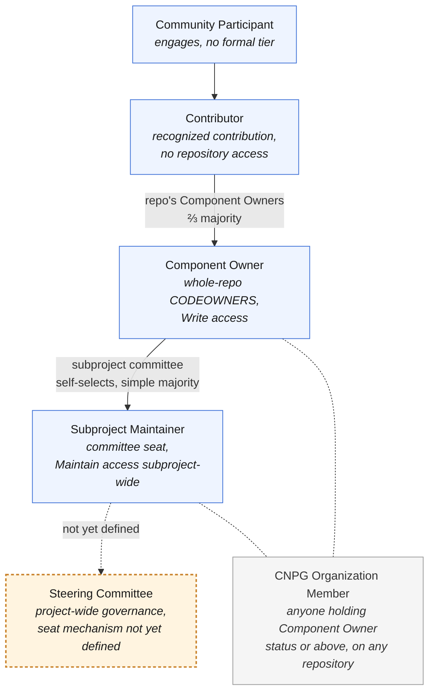

# CloudNativePG Contributor Ladder

This document outlines the contributor roles within CloudNativePG, along with
the responsibilities and privileges that come with each. Community members
generally start at the first rung and advance as their involvement grows;
existing contributors are happy to help newcomers climb it. The ladder is
split at the top into per-subproject rungs, to match CloudNativePG's
federated repository structure, before converging on the Steering Committee
as the top rung; see [the note below](#steering-committee) for what's still
open about how that seat is actually filled.

<!-- Adapted from the CNCF Contributor Ladder template, with one structural
     change: a per-subproject split in place of the template's single,
     project-wide ladder. -->

This document is owned by the [Steering Committee](GOVERNANCE.md#steering-committee):
changes to the ladder's structure, requirements, or thresholds go through a
Steering Committee vote, ⅔ majority (see
[GOVERNANCE.md's Voting section](GOVERNANCE.md#voting)). Day-to-day
promotions and removals under the rules below follow each tier's own
process, unchanged.

- [At a Glance](#at-a-glance)
- [Community Participant](#community-participant)
- [Contributor](#contributor)
- [CNPG Organization Member](#cnpg-organization-member)
- [Component Owner](#component-owner)
- [Subproject Maintainer](#subproject-maintainer)
- [Steering Committee](#steering-committee)
- [Recording a Role Change](#recording-a-role-change)
- [Inactivity](#inactivity)
- [Involuntary Removal](#involuntary-removal)
- [Stepping Down / Emeritus](#stepping-down--emeritus)

## At a Glance

| Tier | Scope | `CODEOWNERS` entry | GitHub access | Promotion vote | Organization cap |
| --- | --- | --- | --- | --- | --- |
| Community Participant | None | None | None | N/A | None |
| Contributor | None (recognition only) | None (may be tagged in a folder-scoped line for review-routing, see note below) | None | Repository's existing Component Owners, simple majority (its subproject committee, if none are named) | None |
| Component Owner | Whole repository | Default (`*`) line | `Write` on the repository | Repository's existing Component Owners, ⅔ majority (its subproject committee, below three named owners) | None |
| Subproject Maintainer | Whole subproject | N/A (committee seat) | `Maintain` across the subproject's repositories | Self-selected by the committee, Steering oversight | None |
| Steering Committee | Project-wide governance | N/A | Not a GitHub permission tier; the `steering-committee` team is the electorate for Steering-scoped `.gitvote.yml` profiles, not a repo-access grant (`Admin` on the org-control repos already comes from the Infrastructure Team, see [Infrastructure Administration](GOVERNANCE.md#infrastructure-administration)) | Open item, not yet defined (see the note below) | None yet |

Folder-scoped `CODEOWNERS` tagging of a Contributor is an operational
choice, not a promotion; see [Contributor](#contributor) and
[Component Owner](#component-owner) below for what it does and doesn't
grant, and how promotion actually works.

## Community Participant

A Community Participant engages with the project and its community without
(yet) being a formally recognized Contributor. Most people start here.

- Responsibilities: follow the [Code of Conduct](CODE_OF_CONDUCT.md).
- Ways to get involved: participating in community discussions, helping
  other users, submitting bug reports, commenting on issues, trying out new
  releases, attending community meetings, promoting the project publicly.

## Contributor

Contributors are members of the community who contribute directly to the
project and add value to it. This is the first formal tier of the ladder.
Contributions are not limited to code: documentation and community work count
too.

- Responsibilities: follow the Code of Conduct and the
  [contributing guide](CONTRIBUTING.md).
- Requirements (one or more of the following): reporting or resolving
  issues, submitting pull requests, contributing to documentation,
  participating in meetings, helping community members, providing feedback
  on issues/PRs, testing releases, or promoting the project in public.
- Privileges: listed in that repository's own `CONTRIBUTORS.md`; eligible to be
  proposed for Component Owner; may, at a repository's discretion, be
  tagged in a folder-scoped `CODEOWNERS` line for review-routing (see
  [At a Glance](#at-a-glance)).
- Promotion: elected by simple majority vote of whichever body currently
  owns the repository by default: its existing Component Owners; if none
  have been individually named, its subproject maintainer committee (see
  [subprojects/README.md](subprojects/README.md#github-teams)). Nomination
  comes from any member of that same deciding body, and the vote is held on
  an issue in the repository the nominee contributed to.

Requirements here are deliberately qualitative rather than numeric.
Advancement is a judgment call by the people closest to the work, not a
metrics threshold.

<!-- Deliberately qualitative: the CNCF template ties some tiers to counts
     (PRs/year, months active), but count-based bars invite gaming
     (drive-by PRs, padding) more than they capture real contribution. -->

## CNPG Organization Member

"CloudNativePG Organization Member" (**CNPG Organization Member** for
short) is not a separate promotion tier; it's the umbrella term for anyone
holding Component Owner status or above, on any repository. The "CNPG"
qualifier is deliberate: plain "organization" is used throughout these
documents to mean the employer an individual works for, and this term
should never be confused with that.

Every CNPG Organization Member is expected to hold a Linux Foundation ID
(LFID) recording their current employer, kept in
[`.project`](https://github.com/cloudnative-pg/.project)'s
`maintainers.yaml`, the same record CNCF's own tooling reads. Every
current Maintainer already holds one; `.project`'s `maintainers.yaml`
just doesn't record it yet (see [MAINTAINERS.md](MAINTAINERS.md)).

## Component Owner

Component Owners are tasked with the development of an entire component
within CloudNativePG: a dedicated repository (e.g. `postgres-containers`),
no more and no less (see [GOVERNANCE.md's Subprojects
section](GOVERNANCE.md#subprojects) for the component definition). A
Component Owner has full technical authority over "everything there": they
don't need sign-off from a subproject committee for routine work in their
own repository.

<!-- Corresponds to the CNCF template's optional "Subproject Maintainer"
     role. CloudNativePG doesn't adopt the template's separate "Reviewer"
     role: folder-scoped CODEOWNERS tagging (see At a Glance) is an
     operational choice, not a formal rung with its own vote and electorate. -->

- Requirements: an established Contributor with a track record and
  demonstrated expertise in the specific component being proposed for.
- Privileges: `Write` access to the relevant repository, whole-repository
  entry in its `CODEOWNERS` file, listed in that repository's own
  `COMPONENT_OWNERS.md`; counts as a
  [CNPG Organization Member](#cnpg-organization-member); eligible to be
  proposed for Subproject Maintainer.
- Promotion: elected by ⅔ majority vote of whichever body currently owns
  the repository by default: its existing Component Owners, provided at
  least three are individually named; below that threshold (including
  none), its subproject maintainer committee (see
  [subprojects/README.md](subprojects/README.md#github-teams)). Nomination
  comes from any member of that same deciding body, and the vote is held on
  an issue in the component's own repository. Removal follows the same
  process.

> [!NOTE]
> **GitHub mechanics:** GitHub grants `Write` at the repository level; there
> is no native way to scope permissions by path. A Component Owner's
> `CODEOWNERS` line is the repository's default (`*`) entry, so they're
> auto-requested and required for review on anything not otherwise covered
> by a folder-scoped line.

> [!NOTE]
> **Folder-scoped review routing:** a repository's Component Owners may add
> a folder-scoped `CODEOWNERS` line naming any Contributor, for
> review-routing convenience only (e.g. `docs/ @some-contributor`). This is
> an operational choice made by lazy consensus among that repository's own
> Component Owners, not a promotion: it grants no additional GitHub
> permission, no vote, and no CNPG Organization Member status. Because a
> "Require review from Code Owners" branch-protection rule only counts an
> approval from someone holding `Write` on the repository, a Contributor
> tagged this way is auto-requested but their approval alone doesn't
> satisfy that rule until they're promoted to Component Owner.

- Path onward: Component Owners of repositories within a formalized
  subproject are expected to become members of that subproject's maintainer
  committee over time, rather than remaining a separate, non-voting tier
  indefinitely. Component ownership continues unchanged for tooling
  repositories that do not have subproject representation.

A repository's existing Component Owners are expected to act on qualified
nominations within a reasonable time. If they don't, or a repository has too
few Component Owners to reach the required threshold, the subproject
maintainer committee may add a Component Owner to that repository directly
(see [GOVERNANCE.md's Contributors and Component Owners
section](GOVERNANCE.md#contributors-and-component-owners)). Steering does
not intervene at the repository level: the committee is always the backstop
for its own repositories, just as Steering is the backstop for a subproject
maintainer committee's own membership, and for a committee that has fallen
below its three-member floor (see
[GOVERNANCE.md's Changes in subproject maintainer committee membership](GOVERNANCE.md#changes-in-subproject-maintainer-committee-membership)).

## Subproject Maintainer

Subproject Maintainers are established contributors responsible for an
entire subproject: technical direction, code review, merge, and release
across every repository under it. "Maintainer" here means membership in one
of the four subproject maintainer committees defined in
[GOVERNANCE.md](GOVERNANCE.md#subprojects); it isn't scoped to a single flat
pool anymore. See
[GOVERNANCE.md's Subproject Maintainer Committees section](GOVERNANCE.md#subproject-maintainer-committees)
for the full responsibilities list, and [MAINTAINERS.md](MAINTAINERS.md) for
current committee rosters.

- Requirements: demonstrated technical judgment and sustained contribution
  across the subproject, as an established Component Owner of one or more
  of its repositories. Being tagged in a folder-scoped `CODEOWNERS` line for
  review-routing does not qualify on its own. A seat also carries an
  ongoing time commitment,
  meaningful enough to sustain the subproject's pace, guidance rather than
  a hard numeric gate, consistent with CloudNativePG's preference for
  qualitative over count-based bars (see the note under
  [Contributor](#contributor) above).
- Responsibilities: the subproject-wide duties in
  [GOVERNANCE.md's Subproject Maintainer Committees section](GOVERNANCE.md#subproject-maintainer-committees),
  including regularly attending the project's community meetings and
  periodically attending Steering Committee meetings to provide input.
- Privileges: `Maintain` GitHub access on the subproject's repositories (see
  [GitHub Teams](GOVERNANCE.md#github-teams-and-communication-channels)); a
  vote in subproject technical decisions; eligible to be selected as the
  subproject's representative to the Steering Committee.
- Promotion: subproject maintainer committees are self-selecting, with
  Steering Committee oversight (see
  [GOVERNANCE.md's Changes in subproject maintainer committee membership](GOVERNANCE.md#changes-in-subproject-maintainer-committee-membership)).

## Steering Committee

The Steering Committee holds project-wide governance authority, sitting
above the per-subproject climb below it (see
[GOVERNANCE.md's Steering Committee section](GOVERNANCE.md#steering-committee)
for its duties and decision-making). Today it's simply the group of
Maintainers listed in [MAINTAINERS.md](MAINTAINERS.md).

- Requirements: today, membership in the existing Maintainers group (see
  [MAINTAINERS.md](MAINTAINERS.md)). A requirement tied to Subproject
  Maintainer standing is expected once the seat mechanism below is
  defined.
- Responsibilities: the project-wide duties in
  [GOVERNANCE.md's Steering Committee Duties section](GOVERNANCE.md#steering-committee-duties).
- Privileges: project-wide governance authority; `Admin` on the
  org-control repos comes from the Infrastructure Team (see
  [Infrastructure Administration](GOVERNANCE.md#infrastructure-administration)),
  not as a consequence of this rung.
- Promotion: **open item**, tracked in
  [cloudnative-pg/governance#68](https://github.com/cloudnative-pg/governance/issues/68).
  How many seats, any per-organisation cap, and how each seat is actually
  filled (for example, each subproject committee selecting a
  representative, plus elected Community Representatives) isn't defined
  in [GOVERNANCE.md](GOVERNANCE.md) yet. Until that's drafted and
  ratified, Steering membership stays today's Maintainers list, not
  something reached by climbing the rungs below.

> **Worked example:** Ana, Ben, and Cleo are Component Owners of `docs`.
> Ana and Cleo are also members of the Community, Docs & Ecosystem
> Maintainer Committee, so they have technical authority over every
> component in that subproject (`docs`, `cloudnative-pg.github.io`,
> `cnpg-playground`, `webtest`, `grafana-dashboards`); Ben's authority
> stays scoped to `docs` alone. (That committee seat doesn't carry
> Steering membership automatically — see Promotion above.)

## Recording a Role Change

A promotion or removal isn't complete once the vote passes; the people who
ran the vote are also responsible for updating every place that role is
recorded, so GitHub access and the public record match the decision.

| Tier | Recorded in |
| --- | --- |
| Contributor | That repository's `CONTRIBUTORS.md`, generated from [`cnpg-infra`](https://github.com/cloudnative-pg/cnpg-infra)'s `repo-tiers.yaml` (`contributors:`) |
| Component Owner | That repository's `COMPONENT_OWNERS.md`, and its `<repo>-owners` GitHub team membership (see [subprojects/README.md's GitHub Teams section](subprojects/README.md#github-teams)); both are generated from one entry in [`cnpg-infra`](https://github.com/cloudnative-pg/cnpg-infra)'s `repo-tiers.yaml`, so recording the vote there does both |
| Subproject Maintainer | [MAINTAINERS.md](MAINTAINERS.md) committee roster; `subproject-*` GitHub team membership (see [GitHub Teams](GOVERNANCE.md#github-teams-and-communication-channels)) |
| Steering Committee | [MAINTAINERS.md](MAINTAINERS.md) Steering Committee table; `steering-committee` GitHub team membership |
| Infrastructure Team | [MAINTAINERS.md](MAINTAINERS.md) Infrastructure Team table; `admins` GitHub team membership (see [GOVERNANCE.md's Infrastructure Administration section](GOVERNANCE.md#infrastructure-administration)) |

> [!IMPORTANT]
> **Open item:** CNCF projects typically also keep a foundation-level
> maintainer list (a `project-maintainers.csv` entry in
> [cncf/foundation](https://github.com/cncf/foundation/blob/main/project-maintainers.csv)
> plus a `cncf-cloudnative-pg-maintainers@lists.cncf.io`-style mailing
> list), updated the same way. See the foundation's own
> [new maintainer guidance](https://github.com/cncf/foundation/blob/main/.github/pull_request_template.md).
> Which CNPG tiers count as "maintainer" there (Subproject Maintainer and
> Steering only, or Component Owner too) hasn't been decided.

<!-- Adapted from Crossplane's GOVERNANCE.md#becoming-a-maintainer, a
     graduated CNCF project. -->

## Inactivity

A tier is considered inactive after at least 6 months with no contribution
or communication in that capacity. Inactivity is a trigger for the
[Involuntary Removal](#involuntary-removal) process below, not a removal in
itself, decided at the same level as promotion for that tier.

A prolonged absence that's been communicated in advance, a parental leave,
a sabbatical, or a known personal circumstance, doesn't count as inactivity
regardless of length: the concern is disappearing without notice, not
simply being away. Someone returning from a communicated absence resumes
their role without needing to re-earn it.

<!-- The 6-month floor matches the CNCF template's own approach of measuring
     inactivity in months of no contribution or communication. -->

## Involuntary Removal

Involuntary removal or demotion follows the same vote-based process, and is
decided at the same level, as promotion for each tier: a repository's
existing Component Owners, for Contributors by simple majority and for
Component Owners by ⅔ majority, with the subproject maintainer committee as
backstop where a repository's owners are stalled or too few to reach the
threshold. This may be triggered by repeated inactivity, failing to meet a
role's requirements, or a Code of Conduct violation.

For Subproject Maintainers, removal is a ⅔ majority of the committee with
the member under review abstaining, and the Steering Committee is the
backstop only when that vote has failed or the committee can't convene one
(see
[GOVERNANCE.md's Changes in subproject maintainer committee membership](GOVERNANCE.md#changes-in-subproject-maintainer-committee-membership)
for the full mechanism).

<!-- This mechanism is the CNCF template's own starting point. -->

## Stepping Down / Emeritus

Contributors at any level can step down voluntarily. Maintainers who step
down are recognized as Emeritus Maintainers (see
[MAINTAINERS.md](MAINTAINERS.md)). Contact the Maintainers of the relevant
subproject about changing your status.
