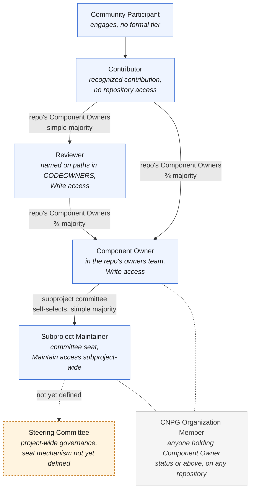

# CloudNativePG Contributor Ladder

This document outlines the contributor roles within CloudNativePG, along with
the responsibilities and privileges that come with each. Community members
generally start at the first rung and advance as their involvement grows;
existing contributors are happy to help newcomers climb it. The ladder is
split at the top into per-subproject rungs, to match CloudNativePG's
federated repository structure, before converging on the Steering Committee
as the top rung; see [the note below](#steering-committee) for what's still
open about how that seat is actually filled.

<!-- Adapted from the CNCF Contributor Ladder template, with one structural
     change: a per-subproject split in place of the template's single,
     project-wide ladder. -->

This document is owned by the [Steering Committee](GOVERNANCE.md#steering-committee):
changes to the ladder's structure, requirements, or thresholds go through a
Steering Committee vote, ⅔ majority (see
[GOVERNANCE.md's Voting section](GOVERNANCE.md#voting)). Day-to-day
promotions and removals under the rules below follow each tier's own
process, unchanged.

- [At a Glance](#at-a-glance)
- [Community Participant](#community-participant)
- [Contributor](#contributor)
- [Reviewer](#reviewer)
- [CNPG Organization Member](#cnpg-organization-member)
- [Component Owner](#component-owner)
- [Subproject Maintainer](#subproject-maintainer)
- [Steering Committee](#steering-committee)
- [Recording a Role Change](#recording-a-role-change)
- [Inactivity](#inactivity)
- [Involuntary Removal](#involuntary-removal)
- [Stepping Down / Emeritus](#stepping-down--emeritus)

## At a Glance

| Tier | Scope | `CODEOWNERS` entry | GitHub access | Promotion vote | Organization cap |
| --- | --- | --- | --- | --- | --- |
| Community Participant | None | None | None | N/A | None |
| Contributor | None (recognition only) | None | None | Repository's existing Component Owners, simple majority (its subproject committee, if none are named) | None |
| Reviewer | Named paths in one repository | Named individually on those paths, advisory | `Write` on the repository; GitHub cannot scope it to those paths | Repository's existing Component Owners, simple majority (its subproject committee, if none are named) | None |
| Component Owner | Whole repository | None individually; the `*` rule names the `<repo>-owners` team they belong to | `Write` on the repository | Repository's existing Component Owners, ⅔ majority (its subproject committee, below three named owners) | None |
| Subproject Maintainer | Whole subproject | N/A (committee seat) | `Maintain` across the subproject's repositories, granted to the committee's GitHub team by `cnpg-infra` from each repository's subproject classification (see [subprojects/README.md](subprojects/README.md#github-teams)) | Self-selected by the committee, Steering oversight | None |
| Steering Committee | Project-wide governance | N/A | Not a GitHub permission tier; the `steering-committee` team is the electorate for Steering-scoped `.gitvote.yml` profiles, not a repo-access grant (`Admin` on the org-control repos already comes from the Infrastructure Team, see [Infrastructure Administration](GOVERNANCE.md#infrastructure-administration)) | Open item, not yet defined (see the note below) | None yet |

`CODEOWNERS` is not where any of this is decided. It is generated from
[`cnpg-infra`](https://github.com/cloudnative-pg/cnpg-infra) and reflects
two different things: **a team named there means ownership**, via the
`<repo>-owners` team the `*` rule points at, and **an individual named
there means review** of the paths that name them. Ownership itself is
recorded in `repo-tiers.yaml` and published in each repository's
`COMPONENT_OWNERS.md`; no Component Owner appears in `CODEOWNERS` by
name.

## Community Participant

A Community Participant engages with the project and its community without
(yet) being a formally recognized Contributor. Most people start here.

- Responsibilities: follow the [Code of Conduct](CODE_OF_CONDUCT.md).
- Ways to get involved: participating in community discussions, helping
  other users, submitting bug reports, commenting on issues, trying out new
  releases, attending community meetings, promoting the project publicly.

## Contributor

Contributors are members of the community who contribute directly to the
project and add value to it. This is the first formal tier of the ladder.
Contributions are not limited to code: documentation and community work count
too.

- Responsibilities: follow the Code of Conduct and the
  [contributing guide](CONTRIBUTING.md).
- Requirements (one or more of the following): reporting or resolving
  issues, submitting pull requests, contributing to documentation,
  participating in meetings, helping community members, providing feedback
  on issues/PRs, testing releases, or promoting the project in public.
- Privileges: listed in that repository's own `CONTRIBUTORS.md`; eligible
  to be proposed for [Reviewer](#reviewer), which is the usual next step,
  or for Component Owner directly. A Contributor cannot be named in
  `CODEOWNERS`: GitHub ignores an entry for anyone without `Write` (see
  [At a Glance](#at-a-glance)).
- Promotion: elected by simple majority vote of whichever body currently
  owns the repository by default: its existing Component Owners; if none
  have been recorded, its subproject maintainer committee (see
  [subprojects/README.md](subprojects/README.md#github-teams)). Nomination
  comes from any member of that same deciding body, and the vote is held on
  an issue in the repository the nominee contributed to.

Requirements here are deliberately qualitative rather than numeric.
Advancement is a judgment call by the people closest to the work, not a
metrics threshold.

<!-- Deliberately qualitative: the CNCF template ties some tiers to counts
     (PRs/year, months active), but count-based bars invite gaming
     (drive-by PRs, padding) more than they capture real contribution. -->

## Reviewer

Reviewers are trusted with review of part of a repository: a directory, a
subsystem, a set of files. They are named individually on those paths in
that repository's `CODEOWNERS`, so GitHub requests them automatically on
any pull request touching their area.

- Requirements: an established Contributor with a track record in the area
  being proposed for.
- Responsibilities: review what you are named on within a reasonable time,
  or say when you cannot. [Inactivity](#inactivity) applies to this rung
  like any other.
- Privileges: named on those paths in `CODEOWNERS`; `Write` on that one
  repository; listed in its `COMPONENT_OWNERS.md` under Reviewers;
  eligible to be proposed for Component Owner.
- Not conferred: organization membership, or
  [CNPG Organization Member](#cnpg-organization-member) status. `Write` is
  granted on that repository alone and can be held as a direct
  collaborator; someone already a member for other reasons keeps that.
- Promotion: elected by simple majority of that repository's existing
  Component Owners, or of its subproject maintainer committee where none
  are recorded, nominated by any member of that body, on an issue in the
  repository itself.

> [!IMPORTANT]
> GitHub grants permissions per repository, never per path, and ignores a
> `CODEOWNERS` entry for anyone without `Write`. A Reviewer therefore holds
> the same repository-wide permission a Component Owner does, including the
> ability to merge a pull request that has met its requirements; the named
> paths are what the project asks of them, not a boundary GitHub enforces.
> The branch ruleset's approvals and checks apply to them as to anyone.

Being named on a path is advisory: the repository's owners are co-owners of
every path, so a Reviewer is always requested and never blocking.

## CNPG Organization Member

"CloudNativePG Organization Member" (**CNPG Organization Member** for
short) is not a separate promotion tier; it's the umbrella term for anyone
holding Component Owner status or above, on any repository.
[Reviewers](#reviewer) are not included despite holding `Write`: the term
marks authority over a component, not access to one. The "CNPG"
qualifier is deliberate: plain "organization" is used throughout these
documents to mean the employer an individual works for, and this term
should never be confused with that.

Every CNPG Organization Member must hold a Linux Foundation ID (LFID) with
their GitHub account linked to it and their current employer recorded on
it. That link is what lets any counting of organizational balance work at
all: without it a GitHub handle maps to no organization. A nomination to
Component Owner collects the LFID profile up front; Component Owners named
before that requirement existed are asked to link one, and a missing link
is a gap to close, not a reason to drop anyone.

Holding an LFID is not the same as being a maintainer of CloudNativePG in
the CNCF's sense. **For CNCF purposes the project's maintainers are the
members of the four subproject maintainer committees and of the Steering
Committee**, and that is who
[`.project`](https://github.com/cloudnative-pg/.project)'s
`maintainers.yaml` and the foundation's own
[`project-maintainers.csv`](https://github.com/cncf/foundation/blob/main/project-maintainers.csv)
record. `maintainers.yaml` carries them under a single
`project-maintainers` team today, one entry per committee once this
document is ratified. Component Owners hold an LFID and appear in their component's
`COMPONENT_OWNERS.md`, but are not listed there: their authority is over
one repository, not the project. See the foundation's
[new maintainer guidance](https://github.com/cncf/foundation/blob/main/.github/pull_request_template.md)
for what that listing involves.

## Component Owner

Component Owners are tasked with the development of an entire component
within CloudNativePG: a dedicated repository (e.g. `postgres-containers`),
no more and no less (see [GOVERNANCE.md's Subprojects
section](GOVERNANCE.md#individual-subproject-governance) for the component definition). A
Component Owner has full technical authority over "everything there": they
don't need sign-off from a subproject committee for routine work in their
own repository.

<!-- Corresponds to the CNCF template's optional "Subproject Maintainer"
     role. The template's separate "Reviewer" role is not adopted here yet,
     though the practice exists: see the note on naming an individual on a
     path, and the separate proposal to formalise it. -->

- Requirements: an established Contributor or [Reviewer](#reviewer) with a
  track record and demonstrated expertise in the component being proposed
  for. Most people arrive here from Reviewer, having already carried review
  of part of it.
- Privileges: `Write` access to the relevant repository, whole-repository
  entry in its `CODEOWNERS` file, listed in that repository's own
  `COMPONENT_OWNERS.md`; counts as a
  [CNPG Organization Member](#cnpg-organization-member); eligible to be
  proposed for Subproject Maintainer.
- Promotion: elected by ⅔ majority vote of whichever body currently owns
  the repository by default: its existing Component Owners, provided at
  least three Component Owners are recorded for it, which Reviewers do not
  count towards; below that threshold (including
  none), its subproject maintainer committee (see
  [subprojects/README.md](subprojects/README.md#github-teams)). Nomination
  comes from any member of that same deciding body, and the vote is held on
  an issue in the component's own repository. Removal follows the same
  process. The threshold at which this rung falls back to the committee is
  higher than the Contributor rung's on purpose: a ⅔ vote among one or two
  owners is either meaningless or a veto, whereas a simple majority still
  behaves sensibly with two.

> [!NOTE]
> **GitHub mechanics:** GitHub grants `Write` at the repository level and
> has no native way to scope permissions by path, so every rung from
> Component Owner down that appears in `CODEOWNERS` at all holds the same
> repository-wide permission. What differs is scope of responsibility, not
> reach. Component Owners are reached through the `<repo>-owners` team on
> the `*` rule, which makes them the reviewers of record for anything no
> narrower rule covers.

> [!NOTE]
> **Naming an individual on a path:** GitHub ignores a `CODEOWNERS` entry
> for anyone without `Write`, silently. It is not that their approval
> counts for less; they are not requested at all, and the line looks
> correct while doing nothing. So an individual named on a path holds
> `Write`, which a Contributor by definition does not, and the practice
> therefore describes a rung above Contributor rather than a way of
> involving one.
>
> That is what the [Reviewer](#reviewer) rung is: the people named on
> paths. It exists in fact today, five of them across `cloudnative-pg`,
> `postgres-extensions-containers` and `klio`, each with `Write` granted by
> hand and recorded in no policy file; naming the rung is what brings that
> access under the same management as everything else.

- Path onward: Component Owners of repositories within a formalized
  subproject are expected to become members of that subproject's maintainer
  committee over time, rather than remaining a separate, non-voting tier
  indefinitely. Component ownership continues unchanged for tooling
  repositories that do not have subproject representation.

A repository's existing Component Owners are expected to act on qualified
nominations within a reasonable time. If they don't, or a repository has too
few Component Owners to reach the required threshold, the subproject
maintainer committee may add a Component Owner to that repository directly
(see [GOVERNANCE.md's Contributors and Component Owners
section](GOVERNANCE.md#contributors-reviewers-and-component-owners)). Steering does
not intervene at the repository level: the committee is always the backstop
for its own repositories, just as Steering is the backstop for a subproject
maintainer committee's own membership, and for a committee that has fallen
below its three-member floor (see
[GOVERNANCE.md's Changes in subproject maintainer committee membership](GOVERNANCE.md#changes-in-subproject-maintainer-committee-membership)).

## Subproject Maintainer

Subproject Maintainers are established contributors responsible for an
entire subproject: technical direction, code review, merge, and release
across every repository under it. "Maintainer" here means membership in one
of the four subproject maintainer committees defined in
[GOVERNANCE.md](GOVERNANCE.md#individual-subproject-governance); it isn't scoped to a single flat
pool anymore. See
[GOVERNANCE.md's Subproject Maintainer Committees section](GOVERNANCE.md#subproject-maintainer-committees)
for the full responsibilities list, and [MAINTAINERS.md](MAINTAINERS.md) for
current committee rosters.

- Requirements: demonstrated technical judgment and sustained contribution
  across the subproject, as an established Component Owner of one or more
  of its repositories. Being named on a path in `CODEOWNERS` does not
  qualify on its own. A seat also carries an
  ongoing time commitment,
  meaningful enough to sustain the subproject's pace, guidance rather than
  a hard numeric gate, consistent with CloudNativePG's preference for
  qualitative over count-based bars (see the note under
  [Contributor](#contributor) above).
- Responsibilities: the subproject-wide duties in
  [GOVERNANCE.md's Subproject Maintainer Committees section](GOVERNANCE.md#subproject-maintainer-committees),
  including regularly attending the project's community meetings and
  periodically attending Steering Committee meetings to provide input.
- Privileges: `Maintain` GitHub access on the subproject's repositories (see
  [GitHub Teams](GOVERNANCE.md#github-teams-and-communication-channels)); a
  vote in subproject technical decisions; eligible to be selected as the
  subproject's representative to the Steering Committee.
- Promotion: subproject maintainer committees are self-selecting, with
  Steering Committee oversight (see
  [GOVERNANCE.md's Changes in subproject maintainer committee membership](GOVERNANCE.md#changes-in-subproject-maintainer-committee-membership)).

## Steering Committee

The Steering Committee holds project-wide governance authority, sitting
above the per-subproject climb below it (see
[GOVERNANCE.md's Steering Committee section](GOVERNANCE.md#steering-committee)
for its duties and decision-making). Today it's simply the group of
Maintainers listed in [MAINTAINERS.md](MAINTAINERS.md).

- Requirements: today, membership in the existing Maintainers group (see
  [MAINTAINERS.md](MAINTAINERS.md)). A requirement tied to Subproject
  Maintainer standing is expected once the seat mechanism below is
  defined.
- Responsibilities: the project-wide duties in
  [GOVERNANCE.md's Steering Committee Duties section](GOVERNANCE.md#steering-committee-duties).
- Privileges: project-wide governance authority; `Admin` on the
  org-control repos comes from the Infrastructure Team (see
  [Infrastructure Administration](GOVERNANCE.md#infrastructure-administration)),
  not as a consequence of this rung.
- Promotion: **open item**, tracked in
  [cloudnative-pg/governance#68](https://github.com/cloudnative-pg/governance/issues/68).
  How many seats, any per-organisation cap, and how each seat is actually
  filled (for example, each subproject committee selecting a
  representative, plus elected Community Representatives) isn't defined
  in [GOVERNANCE.md](GOVERNANCE.md) yet. Until that's drafted and
  ratified, Steering membership stays today's Maintainers list, not
  something reached by climbing the rungs below.

> **Worked example:** Ana, Ben, and Cleo are Component Owners of `docs`.
> Ana and Cleo are also members of the Community, Docs & Ecosystem
> Maintainer Committee, so they have technical authority over every
> component in that subproject (`docs`, `cloudnative-pg.github.io`,
> `cnpg-playground`, `webtest`, `grafana-dashboards`); Ben's authority
> stays scoped to `docs` alone. (That committee seat doesn't carry
> Steering membership automatically — see Promotion above.)

## Recording a Role Change

A promotion or removal isn't complete once the vote passes; the people who
ran the vote are also responsible for updating every place that role is
recorded, so GitHub access and the public record match the decision.

| Tier | Recorded in |
| --- | --- |
| Contributor | That repository's `CONTRIBUTORS.md`, generated from [`cnpg-infra`](https://github.com/cloudnative-pg/cnpg-infra)'s `repo-tiers.yaml` (`contributors:`) |
| Reviewer | That repository's `COMPONENT_OWNERS.md` under Reviewers, the paths naming them in its `CODEOWNERS`, and a `Write` grant on that repository alone, held directly rather than through a team, since the rung implies no organization membership. All three come from one entry in [`cnpg-infra`](https://github.com/cloudnative-pg/cnpg-infra)'s `repo-tiers.yaml` |
| Component Owner | That repository's `COMPONENT_OWNERS.md`, and its `<repo>-owners` GitHub team membership (see [subprojects/README.md's GitHub Teams section](subprojects/README.md#github-teams)); both are generated from one entry in [`cnpg-infra`](https://github.com/cloudnative-pg/cnpg-infra)'s `repo-tiers.yaml`, so recording the vote there does both |
| Subproject Maintainer | [MAINTAINERS.md](MAINTAINERS.md) committee roster; `subproject-*` GitHub team membership (see [GitHub Teams](GOVERNANCE.md#github-teams-and-communication-channels)) |
| Steering Committee | [MAINTAINERS.md](MAINTAINERS.md) Steering Committee table; `steering-committee` GitHub team membership |
| Infrastructure Team | [MAINTAINERS.md](MAINTAINERS.md) Infrastructure Team table; `admins` GitHub team membership (see [GOVERNANCE.md's Infrastructure Administration section](GOVERNANCE.md#infrastructure-administration)) |

A promotion to, or removal from, one of the two committee tiers is also a
change to the project's CNCF-facing maintainer list: update
[`.project`](https://github.com/cloudnative-pg/.project)'s
`maintainers.yaml` and the foundation's `project-maintainers.csv` in the
same pass (see
[CNPG Organization Member](#cnpg-organization-member) for why those two
cover the committee tiers only).

### Keeping affiliation current

Anyone from Component Owner upward who changes employer updates their
affiliation **within 30 days**: their LFID profile first, since everything
else is meant to match it, then whichever of these records names them. For
a committee member that is [MAINTAINERS.md](MAINTAINERS.md)'s Organization
column and `.project`'s `maintainers.yaml`; for a Component Owner it is
`people.yaml` in
[`cnpg-infra`](https://github.com/cloudnative-pg/cnpg-infra), which is what
the generated `COMPONENT_OWNERS.md` files are rendered from. Someone who
leaves an employer without joining another writes "Independent" rather than
leaving the field empty. The Steering Committee checks these against the
LFID records as part of its annual review of organizational diversity (see
[GOVERNANCE.md](GOVERNANCE.md#organizational-diversity)).

<!-- Adapted from Crossplane's GOVERNANCE.md#becoming-a-maintainer, a
     graduated CNCF project. -->

## Inactivity

A tier is considered inactive after at least 6 months with no contribution
or communication in that capacity. Inactivity is a trigger for the
[Involuntary Removal](#involuntary-removal) process below, not a removal in
itself, decided at the same level as promotion for that tier.

A prolonged absence that's been communicated in advance, a parental leave,
a sabbatical, or a known personal circumstance, doesn't count as inactivity
regardless of length: the concern is disappearing without notice, not
simply being away. Someone returning from a communicated absence resumes
their role without needing to re-earn it.

<!-- The 6-month floor matches the CNCF template's own approach of measuring
     inactivity in months of no contribution or communication. -->

## Involuntary Removal

Involuntary removal or demotion follows the same vote-based process, and is
decided at the same level, as promotion for each tier: a repository's
existing Component Owners, for Contributors and Reviewers by simple
majority and for Component Owners by ⅔ majority, with the subproject
maintainer committee as
backstop where a repository's owners are stalled or too few to reach the
threshold. This may be triggered by repeated inactivity, failing to meet a
role's requirements, or a Code of Conduct violation.

For Subproject Maintainers, removal is a ⅔ majority of the committee with
the member under review abstaining, and the Steering Committee is the
backstop only when that vote has failed or the committee can't convene one
(see
[GOVERNANCE.md's Changes in subproject maintainer committee membership](GOVERNANCE.md#changes-in-subproject-maintainer-committee-membership)
for the full mechanism).

<!-- This mechanism is the CNCF template's own starting point. -->

## Stepping Down / Emeritus

Contributors at any level can step down voluntarily. Maintainers who step
down are recognized as Emeritus Maintainers (see
[MAINTAINERS.md](MAINTAINERS.md)). Contact the Maintainers of the relevant
subproject about changing your status.
