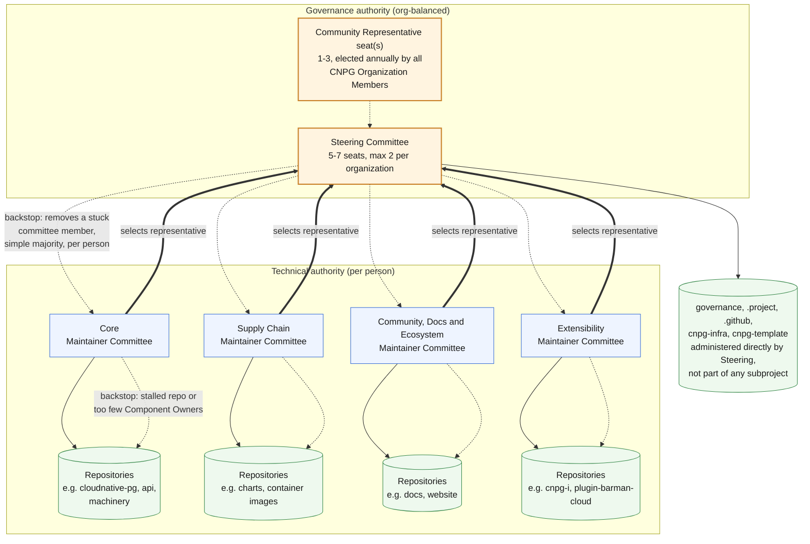

# CloudNativePG Governance

<!-- Section structure and naming mirror the CNCF project-template's
     GOVERNANCE-subprojects.md, adapted for CNPG's four-subproject
     federation (see the subproject-specific sections and Amendments below). -->

This document defines governance policies for the CloudNativePG project.

## Our Mission

*"Run PostgreSQL, the Kubernetes way."*

PostgreSQL is one of the most loved databases in the world, especially in
traditional VM and bare metal installations.

CloudNativePG was originally conceived by PostgreSQL experts and
Kubernetes administrators within [2ndQuadrant](https://www.2ndquadrant.com/) -
later acquired by [EDB](https://www.enterprisedb.com/) - with the goal to
increase the adoption of Postgres within Kubernetes environments.

## Values

Developing a PostgreSQL operator for Kubernetes requires the highest level of
technical quality for both PostgreSQL and Kubernetes.
The goal of CloudNativePG is to innovate in the data in Kubernetes space,
making it easier for organizations to build microservice applications that rely
on a PostgreSQL database directly inside Kubernetes.

We believe that an open source community is the most effective way to address
the complexity of the domain through teamwork, trust, merit, openness,
constructive dissent, diversity, commitment, and accountability.

CloudNativePG and its leadership embrace the following values:

- Technical excellence: Our mindset is to provide the best experience of
  PostgreSQL in Kubernetes, and this requires the highest skills in both
  technologies.

- Built-in Quality and Security: Automated testing is a way to improve
  the quality directly in the product, avoiding manual inspection (citing
  Dr. Deming). Similarly, security must be part of the development process.

- Openness: Communication and decision-making happen in the open and are
  discoverable for future reference. As much as possible, all discussions
  and work take place in public forums and open repositories. Dissent, if
  constructive and expressed with respect and manners, is encouraged as it
  is seen as an innovation enabler.

- Fairness: All stakeholders have the opportunity to provide feedback and submit
  contributions, which will be considered on their merits.

- Community over Product or Company: Sustaining and growing our community takes
  priority over shipping code or sponsors' organizational goals. Each
  contributor participates in the project as an individual, and no single
  organization controls project direction regardless of how many contributors
  it employs.

- Inclusivity: We innovate through different perspectives and skill sets, which
  can only be accomplished in a welcoming and respectful environment.

- Participation: Responsibilities within the project are earned through
  participation, and there is a clear path up the contributor ladder into
  leadership positions, regardless of organizational affiliation.

## Project Structure

CloudNativePG separates **governance authority** from **technical authority**:

- The **Steering Committee** owns project-wide governance: vision, the CNCF
  interface, adding/removing subprojects, subproject maintainer committee
  oversight, security response coordination, and changes to this document.
  It has 5–7 seats, capped at **2 per organization**, the mechanism that
  keeps governance authority from concentrating in one company (see
  [Organizational Cap Enforcement](#organizational-cap-enforcement)). Its
  foundational decisions are org-balanced; its day-to-day business,
  including acting as backstop for a subproject maintainer committee, is
  decided like any committee's, per person. See [Voting](#voting) for the
  full split.
- **Subproject Maintainer Committees** own technical authority within their
  subproject: code review, merge, release, and day-to-day decisions by lazy
  consensus. Technical decisions stay per-person, regardless of
  organization.

This split exists so that organizational diversity in governance does not come
at the expense of the deep technical expertise that got CloudNativePG here.
See [Voting](#voting) for exactly which decisions use which mechanism.

## Individual Subproject Governance

CloudNativePG is organized into four subprojects, aligned directly with the
repository groupings maintained in the [subprojects/](subprojects/README.md)
folder, one file per subproject.

| Subproject | Groupings (see `subprojects/`) |
| :---- | :---- |
| [**Core**](subprojects/core.md) | (no groupings; one flat listing) |
| [**Supply Chain**](subprojects/supply-chain.md) | Distribution, Container Images, Libraries & Automation, Testing & Automation |
| [**Community, Docs & Ecosystem**](subprojects/community-ecosystem.md) | (no groupings; one flat listing) |
| [**Extensibility**](subprojects/extensibility.md) | Interface & Plugins (CNPG-I), External Dependencies, PostgreSQL Extensions & Tooling |

A subproject is made up of one or more **components**, each a GitHub
repository, no more and no less. Each subproject's
maintainer committee has technical authority over every component listed in
its file under [subprojects/](subprojects/README.md).

Component Owner authority and GitHub write access are granted at the
component (repository) level, not automatically across the subproject:
owning one component does not by itself grant access to, or a vote over,
the subproject's other components. Subproject Maintainer Committee
membership, which does carry subproject-wide access and a subproject-wide
vote, is a separate, higher tier built out of established Component
Owners; see [CONTRIBUTOR_LADDER.md](CONTRIBUTOR_LADDER.md) for the full
progression.

> **Example:** Ana, Ben, and Cleo are Component Owners of `docs`. Ana and
> Cleo are also on the Community, Docs & Ecosystem Maintainer Committee,
> which gives them (not Ben) authority across every component in that
> subproject and a say in selecting its Steering representative. See
> [CONTRIBUTOR_LADDER.md's worked example](CONTRIBUTOR_LADDER.md#worked-example)
> for the full walk-through.

Five repositories sit outside any subproject, administered directly by the
Steering Committee:

- `governance`: this document set
- `.project`: CNCF project metadata for landscape/tooling automation
- `.github`: org-wide default Code of Conduct, Contributing guide, and
  other community health files other repositories fall back to
- `cnpg-infra`: tooling that manages GitHub settings, teams, and
  `CODEOWNERS`
- `cnpg-template`: the template every new org repository, including these
  five, is created from

Current subproject maintainer committee membership is kept in
[MAINTAINERS.md](MAINTAINERS.md), not here; committee membership changes
follow the self-selection process in
[Changes in subproject maintainer committee membership](#changes-in-subproject-maintainer-committee-membership)
and don't require a governance vote on this document.

Reorganizing which grouping belongs to which subproject, adding a new
grouping, or moving a component to a different grouping is a routine
editorial change to the relevant `subprojects/*.md` file and does not
require a governance vote. Creating or retiring a subproject itself, i.e.
changing this table, is a Steering Committee decision (see [Voting](#voting)).

### Proposing a New Component

Anyone, inside or outside the project, may propose that a new repository
join CloudNativePG as a component. The proposal is opened as a GitHub issue
against the [governance repository](https://github.com/cloudnative-pg/governance),
using the
[New Component Proposal issue template](.github/ISSUE_TEMPLATE/new_component_proposal.yml),
which collects:

- The proposed repository's name and purpose
- Which existing subproject it belongs to, or, if none fit, a case for why
  a new subproject is needed instead (see
  [Adding New Subprojects](#adding-new-subprojects))
- Confirmation that whoever holds rights to the repository's code is in a
  position to license it under the Apache License 2.0, with a Developer
  Certificate of Origin sign-off on every contribution, and to transfer
  any project trademark and logo assets to the Linux Foundation (CNCF
  Charter §11). CloudNativePG asks for no copyright assignment and
  operates no CLA. Either the rights are already in that position, or the
  proposal describes a concrete plan to get there
- Active development and a real user base, for a repository that already
  has one
- Code and design quality in line with the rest of the project
- The initial Component Owner(s) proposed for it (GitHub handles)
- A description of the proposer's, or proposed owners', long-term
  commitment to maintaining it

Where the repository already has its own contributor base (e.g. an
existing external project), they hold an internal consensus vote to join
CloudNativePG before this proposal is opened.

The proposal is presented at the first available community meeting and
added to its agenda for open discussion (see [Meetings](#meetings)). The
target subproject's maintainer committee then reviews and decides by the
same simple-majority, per-person vote it uses for its own membership (see
[Changes in subproject maintainer committee membership](#changes-in-subproject-maintainer-committee-membership));
a proposal is only accepted once the committee has confirmed the
licensing and IP transfer above. Accepting a proposal is a routine edit
to that subproject's `subprojects/*.md` file, no separate Steering vote
needed. A
proposal that fits no existing subproject is escalated to Steering
instead, as a request to [add a new subproject](#adding-new-subprojects).

Once accepted, onboarding the repository itself is automated end-to-end
by [`cnpg-infra`](https://github.com/cloudnative-pg/cnpg-infra) (see
[Infrastructure Administration](#infrastructure-administration)); this
executes a decision already made above and has no bearing on who makes
it.

A component that isn't yet ready for full status, but is otherwise a good
fit, may instead be accepted as an **Experimental Component**. It joins on
the same terms as any other component and is marked "Experimental" in its
repository and on the website, so adopters can see what they are taking
on. The subproject's committee reviews its Experimental components at
least twice a year and decides, by the same vote it used to accept them,
whether each has matured to full status, should stay Experimental, or
should be archived. A component stays Experimental until that vote says
otherwise.

A component that goes inactive, or stops meeting the project's basic
health expectations (security response, Code of Conduct compliance,
maintained CI), may be archived by the same committee vote, removing it
from the subproject's file, the addition process in reverse. This needs a
Steering vote only if archiving it would leave the subproject with no
components at all, which becomes a
[subproject removal](#removing-subprojects) instead.

<!-- Intake/archival path adapted from Crossplane's Community Extension
     Project lifecycle, scoped to CNPG's single-org repository model. -->

### Subproject Maintainer Committees

A member of a subproject's maintainer committee is what CloudNativePG
simply called a "Maintainer" before this restructuring, back when there was
only one project-wide group by that name. The role hasn't changed, only its
scope has: a committee member is now a CloudNativePG *Subproject*
Maintainer, named for the subproject they serve, matching the section
names already used in [MAINTAINERS.md](MAINTAINERS.md):

- **CloudNativePG Core Maintainer**
- **CloudNativePG Supply Chain Maintainer**
- **CloudNativePG Community, Docs & Ecosystem Maintainer**
- **CloudNativePG Extensibility Maintainer**

Any unqualified "Maintainer" elsewhere in this document means a member of
one of these four committees, regardless of which.

Each subproject has its own maintainer committee, responsible for:

- Technical direction within the subproject
- Code review, merge, and release
- Regular releases and issue triage
- Holding regular subproject-wide discussions on issues and planning
- Making final decisions on subproject changes that involve controversial
  trade-offs
- Responding to security reports within the subproject's scope, escalating to
  the Steering Committee as needed
- Supporting the Code of Conduct within the subproject and referring
  violations to the addresses in [Code of Conduct](#code-of-conduct),
  rather than handling them within the committee
- Selecting the subproject's representative to the Steering Committee
- Regularly attending the project's recurring community meetings
- Periodically attending Steering Committee meetings to provide input, when
  invited or when subproject business is on the agenda

#### Organizational Diversity

A subproject can end up dominated by a single organization even when
CloudNativePG as a whole is not, so each subproject should aspire to
organizational diversity in its own maintainer committee. The Steering
Committee reviews per-subproject diversity at least annually, alongside
the [MAINTAINERS.md](MAINTAINERS.md) Organization column, and gently
encourages a concentrated subproject's committee to grow outside
participation.

#### Changes in subproject maintainer committee membership

Each subproject always has a maintainer committee, of at least three
members. If a committee falls below three, the Steering Committee acts as
caretaker for that subproject, holding its technical authority, until the
committee is back to three; a committee that cannot return to three within
a reasonable period is grounds for reviewing whether the subproject should
be merged or retired. In caretaker mode the committee is, by definition,
too small to self-select: Steering decides additions to it by simple
majority, per person, until it is back to three (see [Voting](#voting)).

Subproject maintainer committees are self-selecting, with Steering
oversight. Eligibility is scoped to established Component Owners of that
subproject's repositories; being named on a path in `CODEOWNERS` doesn't
count. This gives contributors to charts,
plugins, container images, or documentation the same path to governance
influence as contributors to the core operator. A nominee is proposed via
the [Committee Add issue template](.github/ISSUE_TEMPLATE/committee_member_add.yml)
and added by simple majority of the existing committee, per person,
uncapped by organization, deliberately a lighter bar than removal (see
below). Steering's oversight is passive here; it doesn't hold a second
vote on every addition.

A committee removes an unresponsive, CoC-violating, or out-of-remit member
via the [Committee Remove issue template](.github/ISSUE_TEMPLATE/committee_member_remove.yml),
by ⅔ majority of the committee, per person, with the member under review
expected to abstain rather than vote on their own removal. This assumes
the committee can reach that majority without the member's own vote,
which a small or deadlocked committee might not manage.
Steering is the backstop for that case only: it doesn't act on its own
initiative, only when another committee member requests it *and* the
committee's own ⅔ vote has already failed or is demonstrably impossible to
convene. That request is made on the same Committee Remove issue,
escalating it to Steering, which then removes the member by simple
majority of its own members, per person.

<!-- Committee/Steering split mirrors the CNCF project-template's
     GOVERNANCE-subprojects.md individual-subproject-governance mechanism. -->

### GitHub Teams and Communication Channels

Team membership on GitHub is only visible to other members of the
organization, never to the public, regardless of a team's "Visible" or
"Secret" setting; the same is true of private Slack channels. That makes
neither one suitable as the document of record for who holds authority:
[MAINTAINERS.md](MAINTAINERS.md) is, and stays, the public source of
truth for that. GitHub Teams and Slack channels exist only
to *enforce* and support what it already says, never as an
alternative way to find out who's on a committee. The actual team slugs,
grants, and channel names, and how they roll out as each subproject
committee is formalized, are operational detail kept in
[subprojects/README.md](subprojects/README.md).

## Steering Committee

The Steering Committee holds project-wide governance authority. **No single
organization may hold more than 2 of its 5–7 seats**: that cap is the
central structural safeguard of this entire committee, not a footnote (see
[Organizational Cap Enforcement](#organizational-cap-enforcement) for exactly
how it's enforced at election, at selection, and after the fact). The
Committee does not replace the technical authority of subproject maintainer
committees; it exists to ensure that authority over vision, CNCF relations,
and cross-project decisions is not concentrated in a single organization.

**Structure:** 5–7 seats. No single organization may hold more than 2 seats,
regardless of how many of its employees serve across subproject maintainer
committees. Seats serve 2-year staggered terms.

Only elected (Community Representative) seats carry a fixed term; a
subproject-selected seat's tenure is up to that committee (see
[Changes in Steering Committee composition](#changes-in-steering-committee-composition)),
so a mid-term representative swap there doesn't affect any stagger. See
[Bootstrap Composition](#bootstrap-composition) for how the Committee is
first seated and how the stagger gets started.

Members are expected to represent CloudNativePG as a whole rather than
their own subproject or employer, and to deal with other participants
professionally and in keeping with the Code of Conduct.

**Composition:**

- One representative selected by each subproject's maintainer committee (see
  [Individual Subproject Governance](#individual-subproject-governance))
- One to three Community Representatives, elected annually by all
  [CNPG Organization Members](CONTRIBUTOR_LADDER.md#cnpg-organization-member)
  across all subprojects (4 subproject seats plus 1 to 3 Community
  Representative seats span the 5-7 total; see
  [Bootstrap Composition](#bootstrap-composition) for how many of the
  three seats are open in a given cycle)

### Steering Committee Duties

**The Steering Committee owns:**

- **Foundational** (org-balanced, see [Organization-level decisions](#organization-level-decisions)):
  - Curating and proposing changes to this document, ratified by the Steering
    Committee itself
  - Ownership of [CONTRIBUTOR_LADDER.md](CONTRIBUTOR_LADDER.md): the ladder's
    structure, promotion criteria, and any numeric thresholds are a Steering
    Committee decision. Advancement itself is not: every promotion is decided
    per repository or per committee, by the bodies the ladder names
  - Reviewing and deciding on new subprojects to add; removing subprojects
    that have become inactive
- **Standard duties** (day-to-day, per person, see [Voting](#voting)):
  - Project vision and strategic direction
  - The CNCF interface: due diligence responses, public comment, foundation
    communications, and organizing participation in CNCF/LFX programs (for
    example mentorship initiatives) and CNCF events
  - Arbitrating inter-subproject disagreements (for example, a conflict
    between Extensibility and Core over CNPG-I plugin framework
    direction)
  - Code of Conduct reports: reviewing them and ratifying enforcement
    decisions today, and constituting the standing committee that will
    take that over (see [Code of Conduct](#code-of-conduct))
  - Security response coordination (who triages, who patches, the escalation
    path across subprojects) and acting on other escalated code-quality
    issues a subproject can't resolve on its own
  - Resolving other issues that an individual subproject is unable to
    resolve internally
  - Administering project infrastructure, intellectual property, and shared
    resources, including oversight of who holds GitHub organization
    administration and access to sensitive credentials (secrets, CI/CD
    provider accounts). Steering owns this responsibility structurally, so
    it survives individual turnover, but may delegate day-to-day execution
    to a named Infrastructure Team, the same pattern used for security
    response above
  - Determining overall direction for brand, advocacy, and marketing
  - Issuing official statements on behalf of CloudNativePG and its
    subprojects
  - Passive oversight of subproject maintainer committee composition, and
    removal of a committee member when that committee cannot act on its own
    (see [Changes in subproject maintainer committee membership](#changes-in-subproject-maintainer-committee-membership))

**The Steering Committee does not own**, deferring instead to subproject
maintainer committees for:

- Code review and merge decisions
- The release process
- Day-to-day technical decisions within a component or repository, handled
  by lazy consensus among that component's owners (see
  [Voting](#voting) for what "lazy consensus" means); subproject-wide
  decisions spanning multiple components follow the same principle at the
  subproject committee level

### Steering Committee Elections

#### Changes in Steering Committee composition

A subproject maintainer committee may replace its Steering representative at
any time by simple majority of that committee, per person, uncapped by
organization. Community Representative seats are filled by annual election,
one vote per organization among all
[CNPG Organization Members](CONTRIBUTOR_LADDER.md#cnpg-organization-member)
across subprojects (see [Voting](#voting)); the nomination, election, and
vacancy mechanics are set out below.

#### Bootstrap Composition

At the first election, the Steering Committee is seeded close to its full
size rather than phased in gradually: all four subprojects select their
representative as usual, and the Community Representative election opens
2 of its 3 seats, for 6 of the eventual 5-7 seats from day one. The 3rd
Community Representative seat, and any subproject reselection, follow the
normal process from year 2 onward (see
[Community Representative Election Process](#community-representative-election-process)
below).

Whoever holds a seat at bootstrap serves that seat's normal tenure (up to
the subproject committee, for a subproject-selected seat; 2 years, for an
elected Community Representative seat) unless they are one of the
existing (pre-restructuring) CloudNativePG Maintainers, in which case
they serve an initial 1-year term and then step down. That seat is then
filled through the normal process for its type (a fresh subproject
selection, or the next Community Representative election), with no
reservation for or against any particular affiliation; the
[Organizational Cap Enforcement](#organizational-cap-enforcement) rules
are the only constraint. This keeps the bootstrap committee from locking
in pre-restructuring continuity indefinitely, without needing to fix in
advance how many of the initial seats an existing Maintainer actually
ends up holding.

From year 2 on, how many Community Representative seats are open each
cycle isn't a separate decision: it's simply whichever seats reach the
end of their term that year.

#### Community Representative Election Process

Each organization casts one ranked ballot, reflecting the internally
coordinated preference of its own
[CNPG Organization Members](CONTRIBUTOR_LADDER.md#cnpg-organization-member);
unaffiliated individuals each cast their own ranked ballot, consistent with
the org-balanced mechanism this decision already uses (see
[Organization-level decisions](#organization-level-decisions)).

Once a year, the outgoing Steering Committee appoints two or three
**Election Officers** to run the election: CNPG Organization Members in
good standing, not themselves candidates, drawn from more than one
organization. Officers maintain the eligible-voter list, publish
announcements, and conduct the vote.

- **Nomination:** the outgoing Steering Committee opens a public GitHub
  Discussion in the [governance repository](https://github.com/cloudnative-pg/governance)
  at the start of the annual election window, open to every CNPG
  Organization Member across every subproject, stating how many of the one
  to three Community Representative seats (see
  [Bootstrap Composition](#bootstrap-composition) above) are open for
  that cycle. Any CNPG Organization
  Member may nominate up to two candidates there, including themselves. A
  candidate does not need to be a CNPG Organization Member to be
  nominated, but must accept the nomination and be endorsed by CNPG
  Organization Members from two different organizations, in the same
  discussion, before appearing on the ballot.
- **Election:** seats are filled by ranked-choice voting (a Condorcet or
  instant-runoff method, run on an open ranked-choice tool such as
  [CIVS](https://civs1.civs.us/)), one ballot per eligible voter as defined
  above. The top vote-getters, up to the number of open seats, are elected,
  subject to [organizational cap enforcement](#organizational-cap-enforcement)
  below.
- **Vacancy:** a seat vacated mid-term goes to the next-highest-ranked
  candidate from that seat's original election. If no candidate remains, a
  special election is called using the same electorate as the original
  election; eligibility isn't redetermined. The winner serves out the
  remainder of the vacated term.

<!-- Nomination/election/vacancy mechanics adapted from Crossplane's
     GOVERNANCE.md, a graduated CNCF project with a similar Steering model. -->

#### Organizational Cap Enforcement

No single organization may hold more than 2 of the 5-7 Steering seats,
counting committee-selected and elected seats together. Unlike Crossplane's
version of this cap, which only binds once its initial terms expire, CNPG's
cap is enforced from the Steering Committee's very first appointment: the
purpose of this restructuring is to end a single organization's implicit
majority, so the cap cannot be allowed to lapse even temporarily at
bootstrap.

- **At an election:** if the ranked results would seat more than 2
  representatives from one organization, the lowest-ranked candidate(s)
  from the over-represented organization are skipped in favor of the
  next-highest-ranked candidate from a different organization, repeated
  until the cap is satisfied.
- **At a subproject selection:** if a subproject maintainer committee's
  choice of representative would breach the cap, the committee selects a
  different representative instead; the cap constrains who a committee may
  send, not whether it gets a seat.
- **On an affiliation change after the fact** (an acquisition, a merger, or
  a seat-holder changing employer): sufficient seat-holders from the
  now-over-represented organization must resign until the cap is restored.
  If the organization cannot agree who resigns, the question is decided by
  a majority vote of the unaffected Steering Committee members. A vacated
  elected seat is refilled per the vacancy rule above; a vacated
  committee-selected seat is refilled by that subproject's committee
  selecting a new representative.

#### Determining Organizational Affiliation

The 2-per-organization Steering cap, org-balanced voting (see
[Organization-level decisions](#organization-level-decisions)), and the
affiliation-change rule just above all depend on knowing, reliably, which
organization an individual actually belongs to. That determination
is not self-reported: it is each individual's Linux Foundation ID (LFID),
which every Maintainer, Component Owner, and Steering Committee member
must hold and keep current with their correct, present employer. The LFID
record lives in the [`.project`](https://github.com/cloudnative-pg/.project)
repository's `maintainers.yaml`, the same record CNCF's own tooling reads;
[MAINTAINERS.md](MAINTAINERS.md)'s Organization column is sourced from it,
not entered independently, so the two are not two competing records to
reconcile by hand. An LFID that lists the wrong company, or none at all,
doesn't just miss a formality: it can silently understate an
organization's real seat count and break the cap this section exists to
enforce. Registering, or correcting, an LFID is therefore a precondition
of holding a Steering seat or a Subproject Maintainer seat, or of casting
an org-balanced vote as a [CNPG Organization Member](CONTRIBUTOR_LADDER.md#cnpg-organization-member),
not paperwork to catch up on afterward.

> [!IMPORTANT]
> **Open item:** `.project`'s `maintainers.yaml` only lists GitHub handles
> today: no LFID or organization populated yet, which is why several
> [MAINTAINERS.md](MAINTAINERS.md) Organization cells are blank. Tracked as
> a follow-up, not a blocker to ratifying this mechanism.

## Code of Conduct

CloudNativePG has adopted the [CNCF Code of Conduct](CODE_OF_CONDUCT.md)
unchanged. A report can be made in either of two places, and a reporter
never has to choose correctly for it to be handled:

- [conduct@cloudnative-pg.io](mailto:conduct@cloudnative-pg.io), which
  reaches the project.
- [conduct@cncf.io](mailto:conduct@cncf.io), the CNCF Code of Conduct
  Committee, which is independent of this project and can act on any
  report regardless of who it concerns.

**Who handles a report today.** The Steering Committee reviews reports
sent to the project address, confidentially and in closed session, acting
in that capacity rather than as the project's governing body. Where it
finds a violation it decides a response scaled to its severity, from a
private conversation up to expulsion from the project; a demotion or
expulsion is ratified by the Steering Committee in closed session before
it takes effect.

**Where that is not appropriate.** If a report concerns a member of the
Steering Committee, or the reporter would rather it not be read by anyone
in CloudNativePG's leadership, it goes to the CNCF Code of Conduct
Committee instead, whose decision the project applies. Steering does not
review a report about one of its own members, and does not need to be told
that a report has been made to the CNCF.

**Where this is heading.** Handling reports inside Steering is workable
while the project's leadership is small, but it is not the arrangement
this project wants: the reviewer and the governing body should not be the
same five people. The target is a standing **Code of Conduct Committee**
of 3 to 5 people, selected by Steering for diverse representation
(employer, gender, race, background, and region) rather than project
seniority, not limited to existing CloudNativePG contributors, with at
least one member rotated out each year to avoid reviewer fatigue. Steering
constitutes it and records the roster in
[MAINTAINERS.md](MAINTAINERS.md); until that happens, this section
describes what actually occurs.

## Adding New Subprojects

A Steering Committee member proposes a wholly new subproject (as opposed
to a new component joining an existing one, see [Proposing a New
Component](#proposing-a-new-component)), when a candidate doesn't fit any
of the four existing groupings, typically Steering reorganizing existing
components into a new grouping. Anyone may prompt that proposal without
being on Steering themselves, either by asking for it directly or by
opening a component proposal that turns out to fit no existing subproject
(see [Proposing a New Component](#proposing-a-new-component)); only a
Steering member can put it forward. The candidate should show:

- A mission consistent with CloudNativePG's own;
- Appropriate licensing and a compatible governance model, or willingness
  to adopt one;
- Active development and a real user base;
- Code and design quality in line with the rest of the project.

Before applying, the candidate's own contributors hold an internal
consensus vote to join CloudNativePG. Steering then decides by ⅔
majority, one vote per organization (see
[Organization-level decisions](#organization-level-decisions)), the same
bar as amending this document, since each subproject holds its own
Steering seat once accepted. If accepted, Steering assigns one of
its members to help the new subproject integrate (GitHub Teams,
`CODEOWNERS`, its `subprojects/*.md` entry); as part of that integration,
whoever holds rights to the candidate's code confirms they're in a
position to license it under CloudNativePG's Apache License 2.0 and
assign the relevant IP to the CloudNativePG organization under the CNCF,
either because all contributors agree or because a proper DCO process
governs the contribution.

## Removing Subprojects

Any Steering Committee member may propose retiring a subproject that has
gone inactive, become unmaintainable, or asked to leave, decided by the
same vote as adding one. Its components are reassigned to
another subproject by that subproject's committee, or archived per
[Proposing a New Component](#proposing-a-new-component) if none fits;
CloudNativePG has no separate namespace to move an entire subproject into.

## Amendments

This document is amended by a ⅔ majority of the Steering Committee, one
vote per organization (see
[Organization-level decisions](#organization-level-decisions) for the full
decision-type table, including [CONTRIBUTOR_LADDER.md](CONTRIBUTOR_LADDER.md)
and subproject changes). An amendment is proposed as a pull request
against this repository, and the vote is held on that pull request, so
the diff under discussion is the proposal itself. The vote stays open for
at least one week even if it would already pass, so an amendment is
genuinely circulated for comment before it's adopted.

> [!IMPORTANT]
> **Transition note:** this change, which introduces org-balanced voting
> itself, is ratified under the prior rule instead (⅔ majority, per
> person, the same rule the Steering Committee has used since it was
> formed from the existing group of Maintainers): Steering's composition
> doesn't yet have the org cap this change introduces, so a per-org tally
> isn't meaningful for ratifying it. Every later governance change follows
> the org-balanced mechanism above.

Every change to this document is an amendment, including one that looks
purely editorial: the vote opens on any pull request that touches it,
with no exception for a typo. That is deliberate, and it is the reason
the repository listings live in
[subprojects/](subprojects/README.md) instead, where reorganising a
component grouping is routine editorial work needing no vote (see
[Individual Subproject Governance](#individual-subproject-governance)).

## Contributors, Reviewers and Component Owners

The project recognizes different levels of responsibility, forming a
contributor ladder that rewards participation and commitment. The ladder
itself (role definitions, requirements, and promotion/removal process) is
documented in [CONTRIBUTOR_LADDER.md](CONTRIBUTOR_LADDER.md), owned by the
Steering Committee (see [Voting](#voting)); this section covers only the
two rungs below Subproject Maintainer.

Three roles sit below Subproject Maintainer on the ladder: a Contributor
adds value without a defined area of ownership, a Reviewer is trusted with
review of named paths within one component, and a Component Owner owns an
entire component. Their requirements, promotion process, and GitHub
access are defined in [CONTRIBUTOR_LADDER.md](CONTRIBUTOR_LADDER.md), not
here, to avoid keeping the same rules in two places. Component Owners are
recorded in their own component's `COMPONENT_OWNERS.md`, and Contributors
in that same repository's `CONTRIBUTORS.md`, rather than in
[MAINTAINERS.md](MAINTAINERS.md), which lists the committees. Both files
are generated from
[`cnpg-infra`](https://github.com/cloudnative-pg/cnpg-infra), so a
promotion is recorded once and lands wherever it applies. See
[CONTRIBUTOR_LADDER.md's Component Owner section](CONTRIBUTOR_LADDER.md#component-owner)
for what being named in `CODEOWNERS` does and doesn't mean, and the full
promotion mechanism including the subproject committee's backstop role;
not repeated here.

## Meetings

Meeting cadence, format, and joining details for the community, the Steering
Committee, and each subproject are published on the organization page (see
the [CloudNativePG GitHub organization profile](https://github.com/cloudnative-pg)),
not fixed here, so they can evolve without a governance edit. The Steering
Committee's own regular meeting is open to all contributors, with minutes
published for the community; each subproject maintainer committee holds
regular subproject-wide discussions of its own (see
[Subproject Maintainer Committees](#subproject-maintainer-committees)).

Closed meetings are also held to discuss security reports or Code of
Conduct violations, scheduled by any Maintainer on receipt of one. The
Steering Committee and the maintainer committee of each affected
subproject must be invited, rather than every committee in the project:
a security report usually concerns one subproject, and its own
maintainers are the people who can act on it. Anyone accused of a Code of
Conduct violation is not invited. Other sensitive matters, such as removing a Maintainer, may
also be handled in a closed meeting at the discretion of the Steering
Committee or the relevant subproject committee; see [Voting](#voting) for the
principle that governs this.

## CNCF Resources

Any Maintainer may suggest a request for CNCF resources by creating a new
[GitHub discussion under the "Maintainers room" category](https://github.com/cloudnative-pg/cloudnative-pg/discussions/categories/maintainers-room),
or during a meeting. The Steering Committee approves the request as
standard, day-to-day business (see [Voting](#voting)): lazy consensus,
falling back to a simple majority per person. The Steering Committee may
also choose to
delegate working with the CNCF to non-Steering community members.

## Security Response

CloudNativePG uses a hybrid, repository-first model, matching how CVEs are
already handled in the `cloudnative-pg` repository today: a single intake
point at [security@cloudnative-pg.io](mailto:security@cloudnative-pg.io),
triaged by a named Security Response Team, then routed to that component's
Component Owners to develop and validate the fix under embargo.
Subproject maintainer committees own the fix and disclosure timeline for
issues within their own scope; the Security Response Team and Steering
Committee get directly involved only to coordinate across subprojects (for
example, a vulnerability in a component one subproject owns that also
affects a plugin or tool maintained by another subproject), to coordinate
CNCF-level disclosure, or when a subproject can't resolve an issue on its
own. Reporters only ever need to know the single intake address, not
CloudNativePG's internal component structure.

The Steering Committee oversees the security response process, coordinates
across subprojects, and ensures coverage when personnel change.

### Security Response Team

The **Security Response Team** is the named group that watches the intake
address, triages what arrives, decides severity and embargo, and routes
each report to the Component Owners who can fix it. Today it is the
Steering Committee, acting in that capacity; it is a distinct role from
Steering's governance authority, and is expected to grow beyond it as
contributors outside the committee take on security work.

Steering adds and removes members as ordinary Steering business (lazy
consensus, falling back to a simple majority per person), via the
[Delegated Team Membership issue template](.github/ISSUE_TEMPLATE/delegated_team_membership.yml).
A member is onboarded by being added to the roster in
[MAINTAINERS.md](MAINTAINERS.md), to the intake address, and to the
private channel where embargoed reports are discussed; removal reverses
all three, and is also the step taken when someone steps back or becomes
unreachable. Current membership is recorded in
[MAINTAINERS.md](MAINTAINERS.md)'s Security Response Team section, which
is the public record; the same people, with the email addresses reports
reach them at, are listed in
[SECURITY-INSIGHTS.yml](SECURITY-INSIGHTS.yml) (`project.administrators`
and `repository.core-team`), and that file must be updated in the same
pass.

## Infrastructure Administration

The Steering Committee is responsible for the project's infrastructure:
GitHub organization administration, and access to sensitive credentials
such as CI/CD secrets and cloud accounts used by automation, so
responsibility survives individual turnover rather than being tied
informally to whoever happens to hold that access today. In practice,
GitHub team membership and repository permissions are managed
declaratively through the
[`cnpg-infra`](https://github.com/cloudnative-pg/cnpg-infra) repository
rather than by hand, so that access always reflects a committed,
reviewable configuration instead of undocumented manual changes.

Steering delegates day-to-day execution of this responsibility to a named
**Infrastructure Team**: the existing `admins` GitHub team, which holds
`Admin` on every repository in the organization (`cnpg-infra`'s
`global_admin_teams`) and access to the sensitive credentials above. It
is not a ladder rung and not the same body as the Steering Committee,
even though the two happen to have identical membership today.

Steering adds or removes Infrastructure Team (`admins`) members via the
[Delegated Team Membership issue template](.github/ISSUE_TEMPLATE/delegated_team_membership.yml),
per [Voting](#voting): lazy consensus, falling back to a simple majority
per person, the same as its other day-to-day business. Current membership is
recorded in [MAINTAINERS.md](MAINTAINERS.md)'s Infrastructure Team
section; a membership change means updating that roster and reconciling
`cnpg-infra`'s config and the GitHub team from it, same as any other team
in this document.

## Voting

Most business in CloudNativePG is conducted by lazy consensus: a proposal is
considered accepted if no Steering Committee member, Subproject Maintainer,
or Component Owner with standing over that decision raises an objection
within a reasonable review window, so everyday decisions don't need an
explicit vote, only the absence of a block. Periodically, a decision needs
an explicit vote instead.

A threshold is measured against everyone eligible to vote, not against the
votes actually cast, and a proposal carries once support reaches it. Two
consequences are worth stating rather than leaving to be discovered. A
simple majority is reached at exactly half, so two in favour out of four
eligible voters carries. And at ⅔, a committee of three to five members
needs every eligible member except the abstaining one, which makes a
committee-route removal unanimity of the members other than the person
under review.

Votes happen in the open: a public GitHub issue or discussion, explicit
+1/-1 comments from eligible voters, and a final tally posted by whoever
called the vote. A vote stays open for two weeks by default, closing
early once the required threshold is unambiguously met so a decision
isn't held up needlessly once it's already settled. The specific tooling
used to run a vote (CloudNativePG currently uses
[gitvote](https://github.com/cncf/gitvote) for some of this, see
[.gitvote.yml](.gitvote.yml)) is an implementation detail that may change
without a governance edit; the duration and early-closing behavior above
are policy, not tied to any one tool, and the process as a whole is what's
actually required.

### Organization-level decisions

These are Steering's foundational, constitutional-level decisions: the ones
that shape the project's structure or Steering's own composition. They use
**org-balanced voting**: each organization represented among the eligible
voters casts one vote, regardless of how many individuals it has among
those voters. If an organization has multiple eligible voters, those
individuals coordinate internally and cast a single organizational vote;
unaffiliated individuals each cast their own vote. The 2-per-organization
seat cap on Steering limits how skewed its composition can get, but doesn't
by itself make a per-seat vote balanced: an organization holding 2 seats
would otherwise cast 2 votes to every other organization's 1. So these
specific decisions are org-balanced rather than per-seat. Steering's other,
day-to-day business (see [Subproject-level decisions](#subproject-level-decisions)
below for the one example that recurs, backstopping a subproject maintainer
committee) is decided the same way any committee decides routine business:
lazy consensus, falling back to a plain per-person vote among Steering
members.

| Decision Type | Who Votes | Mechanism |
| :---- | :---- | :---- |
| Governance changes (this document, see [Amendments](#amendments)) | Steering Committee | ⅔ majority, one vote per organization |
| Changes to [CONTRIBUTOR_LADDER.md](CONTRIBUTOR_LADDER.md) | Steering Committee | ⅔ majority, one vote per organization |
| Adding/removing subprojects | Steering Committee | ⅔ majority, one vote per organization |
| Steering Committee elections (Community Representative seats) | All CNPG Organization Members, across all subprojects | One vote per organization |
| Infrastructure Team and Security Response Team membership | Steering Committee | Lazy consensus, falling back to simple majority per person |
| Adding a member to a committee in caretaker mode (below three members) | Steering Committee | Simple majority, per person |
| Everything else Steering owns (see [Steering Committee Duties](#steering-committee-duties)) | Steering Committee | Lazy consensus, falling back to simple majority per person |

The other kind of Steering seat, one per subproject, isn't filled by an
org-balanced vote at all: each subproject's own maintainer committee
selects its representative internally, simple majority, per person (see
[Changes in Steering Committee composition](#changes-in-steering-committee-composition)).

### Subproject-level decisions

Subproject technical decisions are per-person, uncapped by organization,
in recognition of the engineering investment individual contributors and
their employers make (see [Project Structure](#project-structure)).

| Decision Type | Who Votes | Mechanism |
| :---- | :---- | :---- |
| Adding a subproject maintainer committee member | The existing members of that committee | Simple majority, per person |
| Removing a subproject maintainer committee member (committee route) | That committee, with the member under review abstaining | ⅔ majority, per person |
| Removing a subproject maintainer committee member (Steering backstop) | Steering Committee | Simple majority, per person |
| Accepting a new component into the subproject | That subproject's committee | Simple majority, per person |
| Confirming an Experimental component has reached full status | That subproject's committee | Simple majority, per person |
| Archiving a component | That subproject's committee | Simple majority, per person |

Repository-level decisions follow the same per-person principle, one level
further down; see [Contributors, Reviewers and Component Owners](#contributors-reviewers-and-component-owners)
above, and [CONTRIBUTOR_LADDER.md's At a Glance table](CONTRIBUTOR_LADDER.md#at-a-glance)
for the full breakdown.

At the discretion of the Steering Committee or a subproject committee, the
deliberation behind a vote may happen privately, for example on
[the private security intake address](mailto:security@cloudnative-pg.io) or
during a closed meeting, for a Maintainer removal or a security matter (see
[Meetings](#meetings)). Privacy applies to the discussion, not the outcome:
the final decision and its rationale, redacted for privacy where needed, are
still announced publicly, consistent with CloudNativePG's commitment to
openness. Any Maintainer may demand a vote be taken.
